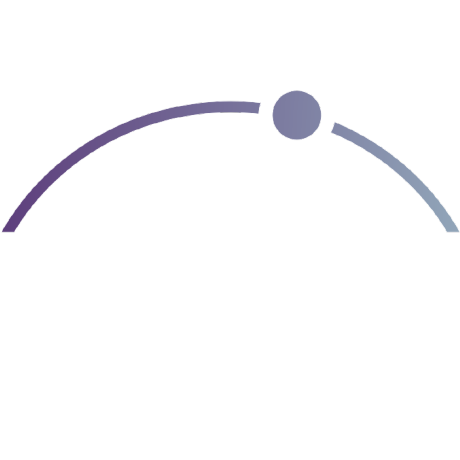

# Sam Rogers

**I build AI on-ramps for humans.**

Follow for open standards, agent tooling, and measurement infrastructure. Weekly essays, regular shipping.

Founder, [PAICE.work](https://paice.work/) · [Snap Synapse](https://snapsynapse.com/)

Systems don't generally fail because the tech is bad. They fail at the handoffs between roles, between agents, between decisions that no one designed to connect. I build the standards, diagnostics, and tooling that make human-AI collaboration structurally sound, not just technically possible.

Interoperability over integration · Measurement over intuition · Structure over speed

---

### Aggregated Intelligence

True intelligence in the AI era is composite: human and machine capabilities combined into something neither can achieve alone. PAICE.work operationalizes this through an Aggregated Intelligence Posture (AIP) measured across three vectors, bounded by the weakest:

| Vector | Product | What it measures |
|---|---|---|
| People | [PAICE.work](https://paice.work/) | How effectively humans and AI actually collaborate. Behavioral, not self-report. |
| Infrastructure | [Siteline](https://siteline.to/) | How ready an organization's digital presence is for AI agents acting on behalf of humans |
| Regulation | [EveryAILaw](https://everyailaw.com/) | How informed and prepared an organization is for AI-specific compliance |

One score, one slide, three places to invest.

---

### PAICE Portfolio: Open Infrastructure

Released independently because interoperability is the point, not lock-in. Built because the existing ecosystem couldn't deliver fast enough.

| Project | What it does |
|---|---|
| [graceful-boundaries](https://github.com/snapsynapse/graceful-boundaries) | Spec for how services communicate operational limits and error context to humans and autonomous agents |
| [turnfile](https://github.com/snapsynapse/turnfile) | File-based protocol for LLM agents to collaborate on shared codebases without real-time channels |
| [skill-provenance](https://github.com/snapsynapse/skill-provenance) | Version identity and integrity verification for agent skill bundles across sessions, surfaces, and platforms |
| [skill-a11y-audit](https://github.com/snapsynapse/skill-a11y-audit) | Drop-in WCAG 2.1 AA accessibility audit for AI coding agents |
| [hardguard25](https://github.com/snapsynapse/hardguard25) | 25-character alphabet for human-friendly unambiguous IDs. Crockford Base32 minus 11 confusable characters. |
| [knowledge-as-code-template](https://github.com/snapsynapse/knowledge-as-code-template) | Pattern for building structured, agent-accessible knowledge bases: static sites, JSON APIs, multi-output from markdown |
| [AITool.watch](https://github.com/snapsynapse/ai-tool-watch) | Evidence-backed reference for AI capabilities, pricing, and platform support across major providers |
| [paice-foundation](https://github.com/snapsynapse/paice-foundation) | Single-page portfolio site for PAICE.work PBC at [paice.foundation](https://paice.foundation/) |

*Privacy-preserving verification via [PAICE-NEAR](https://github.com/snapsynapse/paice-near-integration), consolidating into the main PAICE repo.*

---

### Snap Synapse utilities

Personal tooling. Not part of the PAICE Portfolio brand. Open source.

| Project | What it does |
|---|---|
| [VirtualClassroom.watch](https://github.com/snapsynapse/virtual-classroom-watch) | Structured reference tracking virtual meeting and classroom platform capabilities |
| [substack2md](https://github.com/snapsynapse/substack2md) | Convert Substack newsletters to markdown for local archives and consistent RAG storage |
| [audible-pdf-renamer](https://github.com/snapsynapse/audible-pdf-renamer) | Rename cryptically-named Audible PDF companions to their actual book titles |

---

### Contributing upstream

Active contributor to other people's projects that I use and care about.

| Project | Upstream | My contribution |
|---|---|---|
| [OB1](https://github.com/snapsynapse/OB1) | Nate B. Jones' [Open Brain](https://github.com/NateBJones-Projects/OB1) | Extensions, recipes, skills, and primitives in the Open Brain ecosystem |
| [agentlink](https://github.com/snapsynapse/agentlink) | Martin Mose Facondini's [agentlink](https://github.com/martinmose/agentlink) | CLI enhancements proposed upstream in [PR #2](https://github.com/martinmose/agentlink/pull/2): `detect`, `scan`, `hooks`, `sync --backup`, global config, integration tests |

---

### Companies

- [PAICE.work PBC](https://paice.work/) measures how effectively people and AI systems collaborate. Behavioral diagnostics for People + AI Collaboration Effectiveness.
- [Snap Synapse LLC](https://snapsynapse.com/) helps teams and orgs apply AI responsibly, without the usual drama or damage. Structured implementations that move from AI promise to AI practice.

---

### Support this open infrastructure

The open standards and tooling above are free and always will be. Sponsorship keeps specs evolving, tests passing, and tooling free for everyone. The commercial products (PAICE.work, Siteline, EveryAILaw) sustain themselves through paid tiers.

[github.com/sponsors/snapsynapse](https://github.com/sponsors/snapsynapse)

---

### Collaborating

Currently looking for people working on agent communication protocols, human capability measures, AI regulations and governance structures, and aggregate intelligence infrastructure. Reach out: hello @ sam-rogers .com
