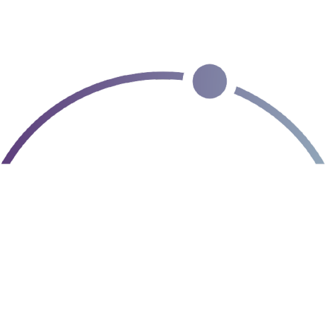

# Sam Rogers

I build AI systems and open protocols that make human-agent work measurable, governable, and verifiable.

I'm the founder of [PAICE.work PBC](https://paice.work/) and [Snap Synapse LLC](https://snapsynapse.com/). Over 25 years, I have built learning, certification, and operational systems that turn new technology into demonstrated human capability. At Google, I led the first YouTube Certified online training program, taking partner certification from about 1,000 classroom participants per year to about 10,000 online participants in its first year.

[PAICE Portfolio](https://paice.foundation/) · [Blog](https://sam-rogers.com/) · [Weekly Show/Newsletter](https://sigsub.show/) · [LinkedIn](https://linkedin.com/in/samrogers/) · [Email](mailto:hello@sam-rogers.com)

## Start here

| If you need to... | Start with | What it does |
|---|---|---|
| Run multiple AI agents without relying on prompt-level guardrails | [Harnessie](https://harnessie.com/) | Enforces independent verification, per-agent file ownership, budgets, sandboxing, human arbitration, and a tamper-evident audit trail |
| Measure how people behave when AI is uncertain, incomplete, or wrong | [PAICE.work](https://paice.work/) | Uses adaptive work simulations to produce behavioral AI-risk evidence instead of another self-report |
| Find out whether AI agents can actually use a website | [Siteline](https://siteline.to/) | Scans reachability, comprehension, navigation, actionability, and machine-readable agent support |
| Let software check which AI laws and obligations apply | [EveryAILaw](https://everyailaw.com/) | Publishes structured regulatory data through a public API and MCP server, with source-linked evidence |
| Make assistant-facing instructions reviewable before an agent acts | [GuideCheck](https://guidecheck.org/) | Defines and verifies a bounded plain-text instruction surface that humans and agents can inspect identically |

## What connects the work

AI systems often fail around the model: people overtrust uncertain output, agents cross authority boundaries, websites hide the next step, and regulatory duties arrive as prose that software cannot use. I turn those failure points into things people and software can inspect, test, and improve.

[PAICE.work PBC](https://paice.foundation/) builds measurement products, regulatory infrastructure, and their supporting open standards. [Snap Synapse LLC](https://snapsynapse.com/) is my consulting and open-source practice, including Harnessie, Agentlink, and developer utilities. The entities are separate; the operating principle is shared: important claims should come with evidence.

## Proof, with the limits left in

What you can inspect today is working software, public release history, enforced tests, live APIs, open specifications, threat models, and the decisions behind them.

- Five merged pull requests across Nate B. Jones' [Open Brain](https://github.com/NateBJones-Projects/OB1) and [Ringer](https://github.com/NateBJones-Projects/ringer), with two more in review. The merged work includes Obsidian import, local Ollama embeddings, and the [openbrain.fyi](https://openbrain.fyi/) landing and deployment workflow.
- [Skill Provenance](https://github.com/snapsynapse/skill-provenance) is listed in [Awesome OpenClaw Skills](https://github.com/VoltAgent/awesome-openclaw-skills).
- [Signals & Subtractions](https://sigsub.show/) livestreams every Wednesday, releases a new episode every Friday, and publishes a new newsletter every Sunday. I also publish frequent field notes at [sam-rogers.com](https://sam-rogers.com/).
- The five projects in the Start here table are live now. The three commercial products expose real offers.

## Selected open work

Agent execution, coordination, and trust

| Project | Use it when... |
|---|---|
| [Harnessie](https://github.com/snapsynapse/harnessie) | Multi-agent work needs enforceable controls, independent verification, and an inspectable audit trail |
| [Agentlink](https://github.com/snapsynapse/agentlink) | One canonical `AGENTS.md` needs to reach multiple AI coding tools without copied configuration |
| [Turnfile](https://github.com/snapsynapse/turnfile) | Peer agents need auditable disagreement, explicit turns, and human-governed resolution |
| [AIDR](https://github.com/snapsynapse/aidr) | A consequential AI-assisted decision needs independent positions, preserved dissent, and human arbitration in one file |
| [GuideCheck](https://github.com/snapsynapse/guidecheck) | The instructions an agent executes must match the surface a human reviewed |
| [Graceful Boundaries](https://github.com/snapsynapse/graceful-boundaries) | A service needs to communicate operational limits clearly to people and agents |
| [Skill Provenance](https://github.com/snapsynapse/skill-provenance) | Agent Skill bundles need portable version identity, integrity checks, and drift detection |

Measurement, regulation, and public knowledge

| Project | Use it when... |
|---|---|
| [AI Posture](https://github.com/snapsynapse/ai-posture) | An organization needs one view across human capability, agent-ready infrastructure, and regulation |
| [AI Incident Law](https://github.com/snapsynapse/ai-incident-law) | AI-related legal and regulatory incidents need searchable, source-linked public tracking |
| [Obligation First](https://github.com/snapsynapse/obligation-first) | Laws, cases, and agreements need machine-readable structure around who owes what to whom |
| [PubLedge](https://github.com/snapsynapse/publedge) | Public interpretations and notices need verifiable, hash-pinned publication records |
| [Knowledge as Code](https://github.com/snapsynapse/knowledge-as-code-template) | A structured knowledge base needs version control, validation, and human and machine outputs from one source |
| [AI Tool Watch](https://github.com/snapsynapse/ai-tool-watch) | AI capability claims need a plain-language, model-checked reference |
| [A11y Audit](https://github.com/snapsynapse/skill-a11y-audit) | Agent-generated web code needs portable WCAG quality gates |

[Browse all public repositories](https://github.com/snapsynapse?tab=repositories)

## Work with me

The strongest fit is with people building agent infrastructure, deploying AI in regulated organizations, or trying to turn AI capability into an operating system that humans can trust.

| If you want to... | Best next step |
|---|---|
| Test or adopt an open tool or protocol | Open an issue in its repository with the real workflow you want it to survive |
| Explore consulting, product collaboration, or a partnership | [Email me](mailto:hello@sam-rogers.com) with what you are building and the failure boundary you cannot yet measure |
| Discuss a senior builder or operator role | Start with my [work and evidence](https://sam-rogers.com/) |
| Follow the thinking behind the work | Read [Signals & Subtractions](https://sigsub.show/) or the field notes at [sam-rogers.com](https://sam-rogers.com/) |

Open-source sponsorship supports the specifications, tests, and public tooling: [GitHub Sponsors](https://github.com/sponsors/snapsynapse).
